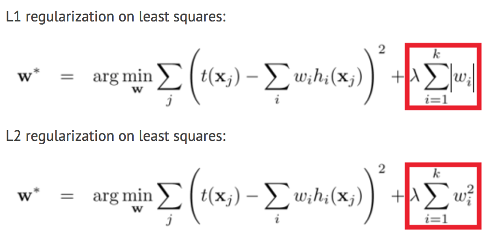
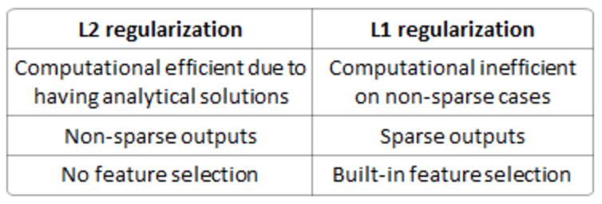
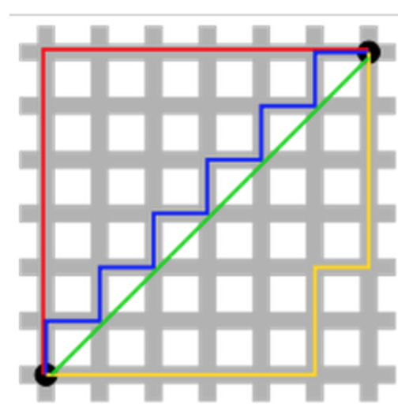
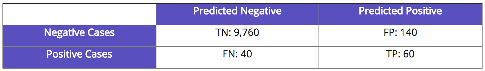
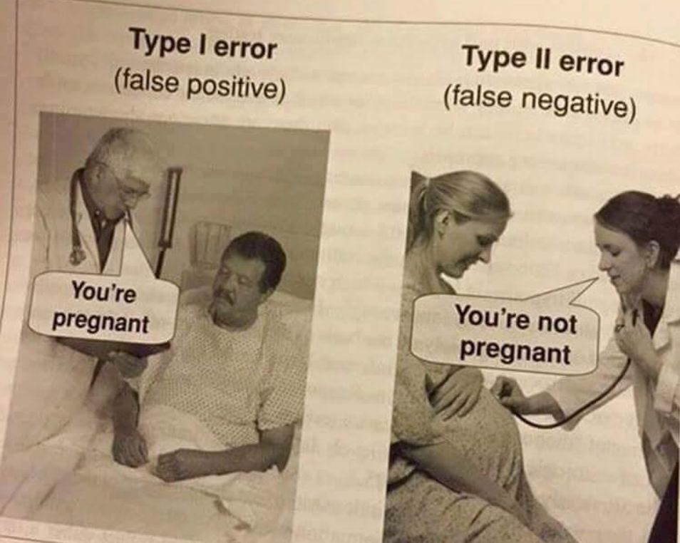
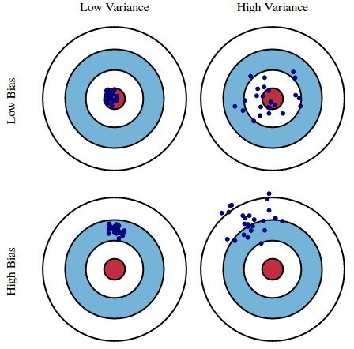
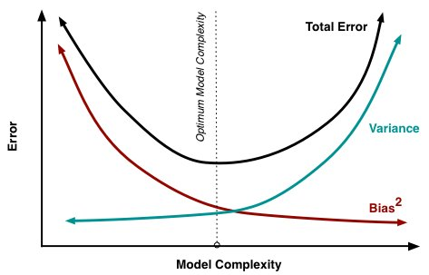
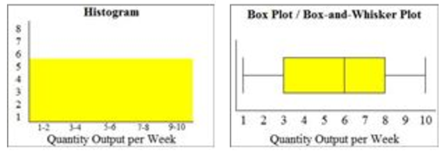
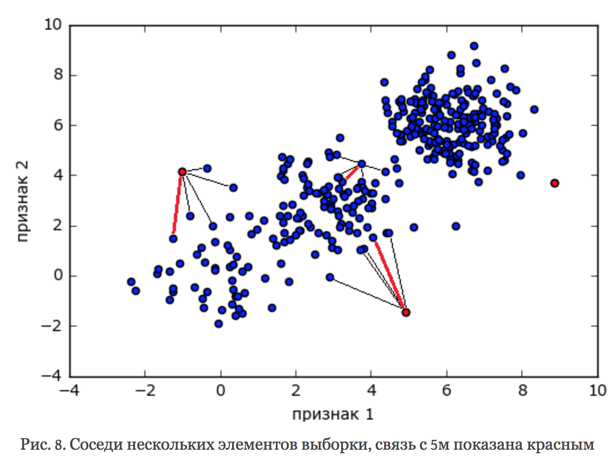
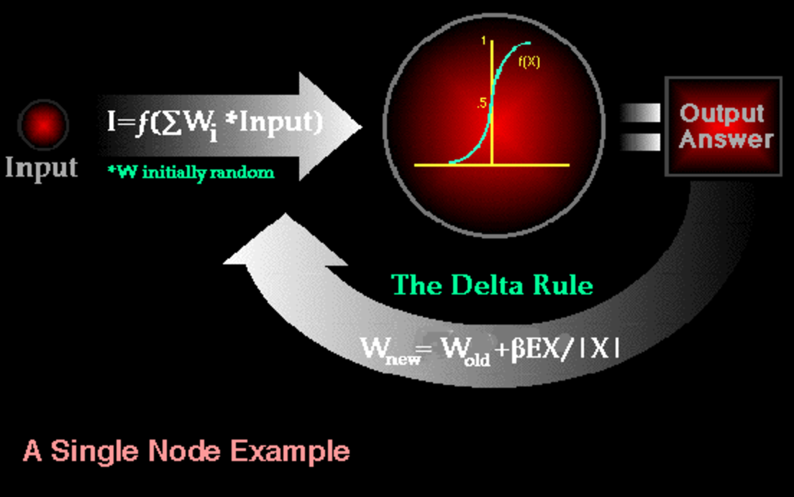

[Source](https://docs.google.com/document/d/1ajyJhXyt4q9ZsufXV1kZxDH_3Isg3MYAKsFqNytXrCw/)

- [1. Why do you use feature selection?](#1-why-do-you-use-feature-selection)
    - [Filter Methods](#filter-methods)
    - [Embedded Methods](#embedded-methods)
    - [Misleading](#misleading)
    - [Overfitting](#overfitting)
- [2. Explain what regularization is and why it is useful.](#2-explain-what-regularization-is-and-why-it-is-useful)
- [3. What’s the difference between L1 and L2 regularization?](#3-whats-the-difference-between-l1-and-l2-regularization)
- [4. How would you validate a model you created to generate a predictive model of a quantitative outcome variable using multiple regression?](#4-how-would-you-validate-a-model-you-created-to-generate-a-predictive-model-of-a-quantitative-outcome-variable-using-multiple-regression)
- [5. Explain what precision and recall are. How do they relate to the ROC curve?](#5-explain-what-precision-and-recall-are-how-do-they-relate-to-the-roc-curve)
- [6. Is it better to have too many false positives, or too many false negatives?](#6-is-it-better-to-have-too-many-false-positives--or-too-many-false-negatives)
- [7. How do you deal with unbalanced binary classification?](#7-how-do-you-deal-with-unbalanced-binary-classification)
- [8. What is statistical power?](#8-what-is-statistical-power)
- [9. What are bias and variance, and what are their relation to modeling data?](#9-what-are-bias-and-variance--and-what-are-their-relation-to-modeling-data)
    - [Approaches](#approaches)
- [10. What if the classes are imbalanced? What if there are more than 2 groups?](#10-what-if-the-classes-are-imbalanced-what-if-there-are-more-than-2-groups)
- [11. What are some ways I can make my model more robust to outliers?](#11-what-are-some-ways-i-can-make-my-model-more-robust-to-outliers)
- [12. In unsupervised learning, if a ground truth about a dataset is unknown, how can we determine the most useful number of clusters to be?](#12-in-unsupervised-learning--if-a-ground-truth-about-a-dataset-is-unknown--how-can-we-determine-the-most-useful-number-of-clusters-to-be)
- [13. Define variance](#13-define-variance)
- [14. Expected value](#14-expected-value)
- [15. Describe the differences between and use cases for box plots and histograms](#15-describe-the-differences-between-and-use-cases-for-box-plots-and-histograms)
- [16. How would you find an anomaly in a distribution?](#16-how-would-you-find-an-anomaly-in-a-distribution)
    - [Statistical methods](#statistical-methods)
    - [Metric methods](#metric-methods)
- [17. How do you deal with outliers in your data?](#17-how-do-you-deal-with-outliers-in-your-data)
- [18. How do you deal with sparse data?](#18-how-do-you-deal-with-sparse-data)
- [19. Big Data Engineer Can you explain what REST is?](#19-big-data-engineer-can-you-explain-what-rest-is)
- [20. Logistic regression](#20-logistic-regression)
- [21. What is the effect on the coefficients of logistic regression if two predictors are highly correlated? What are the confidence intervals of the coefficients?](#21-what-is-the-effect-on-the-coefficients-of-logistic-regression-if-two-predictors-are-highly-correlated-what-are-the-confidence-intervals-of-the-coefficients)
- [22. What’s the difference between Gaussian Mixture Model and K-Means?](#22-whats-the-difference-between-gaussian-mixture-model-and-k-means)
- [23. Describe how Gradient Boosting works.](#23-describe-how-gradient-boosting-works)
  - [AdaBoost the First Boosting Algorithm](#adaboost-the-first-boosting-algorithm)
    - [Loss Function](#loss-function)
    - [Weak Learner](#weak-learner)
    - [Additive Model](#additive-model)
  - [Improvements to Basic Gradient Boosting](#improvements-to-basic-gradient-boosting)
    - [Tree Constraints](#tree-constraints)
    - [Weighted Updates](#weighted-updates)
    - [Stochastic Gradient Boosting](#stochastic-gradient-boosting)
    - [Penalized Gradient Boosting](#penalized-gradient-boosting)
- [24. Difference between AdaBoost and XGBoost](#24-difference-between-AdaBoost-and-XGBoost)
- [25. Data Mining Describe the decision tree model.](#25-data-mining-describe-the-decision-tree-model)
- [26. Notes from Coursera Deep Learning courses by Andrew Ng](#26-notes-from-coursera-deep-learning-courses-by-andrew-ng)
- [27. What is a neural network?](#27-what-is-a-neural-network)
- [28. How do you deal with sparse data?](#28-how-do-you-deal-with-sparse-data)
- [29. RNN and LSTM](#29-rnn-and-lstm)
- [30. Pseudo Labeling](#30-pseudo-labeling)
- [31. Knowledge Distillation](#31-knowledge-distillation)


## 1. Why do you use feature selection?
Feature selection is the process of selecting a subset of relevant features for use in model construction. Feature selection is itself useful, but it mostly acts as a filter, muting out features that aren’t useful in addition to your existing features.
Feature selection methods aid you in your mission to create an accurate predictive model. They help you by choosing features that will give you as good or better accuracy whilst requiring less data.
Feature selection methods can be used to identify and remove unneeded, irrelevant and redundant attributes from data that do not contribute to the accuracy of a predictive model or may in fact decrease the accuracy of the model.
Fewer attributes is desirable because it reduces the complexity of the model, and a simpler model is simpler to understand and explain.
#### Filter Methods
Filter feature selection methods apply a statistical measure to assign a scoring to each feature. The features are ranked by the score and either selected to be kept or removed from the dataset. The methods are often univariate and consider the feature independently, or with regard to the dependent variable.
Some examples of some filter methods include the Chi squared test, information gain and correlation coefficient scores.
#### Embedded Methods
Embedded methods learn which features best contribute to the accuracy of the model while the model is being created. The most common type of embedded feature selection methods are regularization methods.
Regularization methods are also called penalization methods that introduce additional constraints into the optimization of a predictive algorithm (such as a regression algorithm) that bias the model toward lower complexity (fewer coefficients).
Examples of regularization algorithms are the LASSO, Elastic Net and Ridge Regression.
#### Misleading
Including redundant attributes can be misleading to modeling algorithms. Instance-based methods such as k-nearest neighbor use small neighborhoods in the attribute space to determine classification and regression predictions. These predictions can be greatly skewed by redundant attributes.
#### Overfitting
Keeping irrelevant attributes in your dataset can result in overfitting. Decision tree algorithms like C4.5 seek to make optimal spits in attribute values. Those attributes that are more correlated with the prediction are split on first. Deeper in the tree less relevant and irrelevant attributes are used to make prediction decisions that may only be beneficial by chance in the training dataset. This overfitting of the training data can negatively affect the modeling power of the method and cripple the predictive accuracy.

## 2. Explain what regularization is and why it is useful.
Regularization is the process of adding a tuning parameter to a model to induce smoothness in order to prevent [overfitting](https://en.wikipedia.org/wiki/Overfitting).

This is most often done by adding a constant multiple to an existing weight vector. This constant is often either the [L1 (Lasso)](https://en.wikipedia.org/wiki/Lasso_(statistics)) or [L2 (ridge)](https://en.wikipedia.org/wiki/Tikhonov_regularization), but can in actuality can be any norm. The model predictions should then minimize the mean of the loss function calculated on the regularized training set.

It is well known, as explained by others, that L1 regularization helps perform feature selection in sparse feature spaces, and that is a good practical reason to use L1 in some situations. However, beyond that particular reason I have never seen L1 to perform better than L2 in practice. If you take a look at [LIBLINEAR FAQ](https://www.csie.ntu.edu.tw/~cjlin/liblinear/FAQ.html#l1_regularized_classification) on this issue you will see how they have not seen a practical example where L1 beats L2 and encourage users of the library to contact them if they find one. Even in a situation where you might benefit from L1's sparsity in order to do feature selection, using L2 on the remaining variables is likely to give better results than L1 by itself.

## 3. What’s the difference between L1 and L2 regularization?
Regularization is a very important technique in machine learning to prevent overfitting. Mathematically speaking, it adds a regularization term in order to prevent the coefficients to fit so perfectly to overfit. The difference between the L1(Lasso) and L2(Ridge) is just that L2(Ridge) is the sum of the square of the weights, while L1(Lasso) is just the sum of the absolute weights in MSE or another loss function. As follows:

The difference between their properties can be promptly summarized as follows:


**Solution uniqueness** is a simpler case but requires a bit of imagination. First, this picture below:


## 4. How would you validate a model you created to generate a predictive model of a quantitative outcome variable using multiple regression?
[Proposed methods](http://support.sas.com/resources/papers/proceedings12/333-2012.pdf) for model validation:
* If the values predicted by the model are far outside of the response variable range, this would immediately indicate poor estimation or model inaccuracy.
* If the values seem to be reasonable, examine the parameters; any of the following would indicate poor estimation or multi-collinearity: opposite signs of expectations, unusually large or small values, or observed inconsistency when the model is fed new data.
* Use the model for prediction by feeding it new data, and use the [coefficient of determination](https://en.wikipedia.org/wiki/Coefficient_of_determination) (R squared) as a model validity measure.
* Use data splitting to form a separate dataset for estimating model parameters, and another for validating predictions.
* Use [jackknife resampling](https://en.wikipedia.org/wiki/Jackknife_resampling) if the dataset contains a small number of instances, and measure validity with R squared and [mean squared error](https://en.wikipedia.org/wiki/Mean_squared_error) (MSE).

## 5. Explain what precision and recall are. How do they relate to the ROC curve?
Calculating precision and recall is actually quite easy. Imagine there are 100 positive cases among 10,000 cases. You want to predict which ones are positive, and you pick 200 to have a better chance of catching many of the 100 positive cases. You record the IDs of your predictions, and when you get the actual results you sum up how many times you were right or wrong. There are four ways of being right or wrong:
1. TN / True Negative: case was negative and predicted negative
2. TP / True Positive: case was positive and predicted positive
3. FN / False Negative: case was positive but predicted negative
4. FP / False Positive: case was negative but predicted positive



Now, your boss asks you three questions:
* What percent of your predictions were correct?
You answer: the "accuracy" was (9,760+60) out of 10,000 = 98.2%
* What percent of the positive cases did you catch?
You answer: the "recall" was 60 out of 100 = 60%
* What percent of positive predictions were correct?
You answer: the "precision" was 60 out of 200 = 30%
See also a very good explanation of [Precision and recall](https://en.wikipedia.org/wiki/Precision_and_recall) in Wikipedia.


ROC curve represents a relation between sensitivity (RECALL) and specificity(NOT PRECISION) and is commonly used to measure the performance of binary classifiers. However, when dealing with highly skewed datasets, [Precision-Recall (PR)](http://pages.cs.wisc.edu/~jdavis/davisgoadrichcamera2.pdf) curves give a more representative picture of performance. Remember, a ROC curve represents a relation between sensitivity (RECALL) and specificity(NOT PRECISION). Sensitivity is the other name for recall but specificity is not PRECISION.

Recall/Sensitivity is the measure of the probability that your estimate is 1 given all the samples whose true class label is 1. It is a measure of how many of the positive samples have been identified as being positive. Specificity is the measure of the probability that your estimate is 0 given all the samples whose true class label is 0. It is a measure of how many of the negative samples have been identified as being negative.

PRECISION on the other hand is different. It is a measure of the probability that a sample is a true positive class given that your classifier said it is positive. It is a measure of how many of the samples predicted by the classifier as positive is indeed positive. Note here that this changes when the base probability or prior probability of the positive class changes. Which means PRECISION depends on how rare is the positive class. In other words, it is used when positive class is more interesting than the negative class.

* Sensitivity also known as the True Positive rate or Recall is calculated as,
`Sensitivity = TP / (TP + FN)`. Since the formula doesn’t contain FP and TN, Sensitivity may give you a biased result, especially for imbalanced classes.
In the example of Fraud detection, it gives you the percentage of Correctly Predicted Frauds from the pool of Actual Frauds pool of Actual Non-Frauds.
* Specificity, also known as True Negative Rate is calculated as, `Specificity = TN / (TN + FP)`. Since the formula does not contain FN and TP, Specificity may give you a biased result, especially for imbalanced classes.
In the example of Fraud detection, it gives you the percentage of Correctly Predicted Non-Frauds from the pool of Actual Frauds pool of Actual Non-Frauds

[Assessing and Comparing Classifier Performance with ROC Curves](https://machinelearningmastery.com/assessing-comparing-classifier-performance-roc-curves-2/)

## 6. Is it better to have too many false positives, or too many false negatives?
It depends on the question as well as on the domain for which we are trying to solve the question.

In medical testing, false negatives may provide a falsely reassuring message to patients and physicians that disease is absent, when it is actually present. This sometimes leads to inappropriate or inadequate treatment of both the patient and their disease. So, it is desired to have too many false positive.

For spam filtering, a false positive occurs when spam filtering or spam blocking techniques wrongly classify a legitimate email message as spam and, as a result, interferes with its delivery. While most anti-spam tactics can block or filter a high percentage of unwanted emails, doing so without creating significant false-positive results is a much more demanding task. So, we prefer too many false negatives over many false positives.

## 7. How do you deal with unbalanced binary classification?
Imbalanced data typically refers to a problem with classification problems where the classes are not represented equally.
For example, you may have a 2-class (binary) classification problem with 100 instances (rows). A total of 80 instances are labeled with Class-1 and the remaining 20 instances are labeled with Class-2.

This is an imbalanced dataset and the ratio of Class-1 to Class-2 instances is 80:20 or more concisely 4:1.
You can have a class imbalance problem on two-class classification problems as well as multi-class classification problems. Most techniques can be used on either.
The remaining discussions will assume a two-class classification problem because it is easier to think about and describe.
1. Can You Collect More Data?</br>
A larger dataset might expose a different and perhaps more balanced perspective on the classes.
More examples of minor classes may be useful later when we look at resampling your dataset.
2. Try Changing Your Performance Metric</br>
Accuracy is not the metric to use when working with an imbalanced dataset. We have seen that it is misleading.
From that post, I recommend looking at the following performance measures that can give more insight into the accuracy of the model than traditional classification accuracy:
  - [Confusion Matrix](https://en.wikipedia.org/wiki/Confusion_matrix): A breakdown of predictions into a table showing correct predictions (the diagonal) and the types of incorrect predictions made (what classes incorrect predictions were assigned).
  - [Precision](https://en.wikipedia.org/wiki/Information_retrieval#Precision): A measure of a classifiers exactness. Precision is the number of True Positives divided by the number of True Positives and False Positives. Put another way, it is the number of positive predictions divided by the total number of positive class values predicted. It is also called the [Positive Predictive Value (PPV)](https://en.wikipedia.org/wiki/Positive_and_negative_predictive_values). Precision can be thought of as a measure of a classifiers exactness. A low precision can also indicate a large number of False Positives.
  - [Recall](https://en.wikipedia.org/wiki/Information_retrieval#Recall): A measure of a classifiers completeness. Recall is the number of True Positives divided by the number of True Positives and the number of False Negatives. Put another way it is the number of positive predictions divided by the number of positive class values in the test data. It is also called Sensitivity or the True Positive Rate. Recall can be thought of as a measure of a classifiers completeness. A low recall indicates many False Negatives.
  - [F1 Score (or F-score)](https://en.wikipedia.org/wiki/F1_score): A weighted average of precision and recall.
I would also advise you to take a look at the following:
  - Kappa (or [Cohen’s kappa](https://en.wikipedia.org/wiki/Cohen%27s_kappa)): Classification accuracy normalized by the imbalance of the classes in the data.
ROC Curves: Like precision and recall, accuracy is divided into sensitivity and specificity and models can be chosen based on the balance thresholds of these values.
3. Try Resampling Your Dataset
  * You can add copies of instances from the under-represented class called over-sampling (or more formally sampling with replacement)
  * You can delete instances from the over-represented class, called under-sampling.
5. Try Different Algorithms
6. Try Penalized Models</br>
You can use the same algorithms but give them a different perspective on the problem.
Penalized classification imposes an additional cost on the model for making classification mistakes on the minority class during training. These penalties can bias the model to pay more attention to the minority class.
Often the handling of class penalties or weights are specialized to the learning algorithm. There are penalized versions of algorithms such as penalized-SVM and penalized-LDA.
Using penalization is desirable if you are locked into a specific algorithm and are unable to resample or you’re getting poor results. It provides yet another way to “balance” the classes. Setting up the penalty matrix can be complex. You will very likely have to try a variety of penalty schemes and see what works best for your problem.
7. Try a Different Perspective</br>
Taking a look and thinking about your problem from these perspectives can sometimes shame loose some ideas.
Two you might like to consider are anomaly detection and change detection.

## 8. What is statistical power?
[Statistical power or sensitivity](https://en.wikipedia.org/wiki/Statistical_power) of a binary hypothesis test is the probability that the test correctly rejects the null hypothesis (H0) when the alternative hypothesis (H1) is true.

It can be equivalently thought of as the probability of accepting the alternative hypothesis (H1) when it is true—that is, the ability of a test to detect an effect, if the effect actually exists.

To put in another way, [Statistical power](https://effectsizefaq.com/2010/05/31/what-is-statistical-power/) is the likelihood that a study will detect an effect when the effect is present. The higher the statistical power, the less likely you are to make a Type II error (concluding there is no effect when, in fact, there is).

A type I error (or error of the first kind) is the incorrect rejection of a true null hypothesis. Usually a type I error leads one to conclude that a supposed effect or relationship exists when in fact it doesn't. Examples of type I errors include a test that shows a patient to have a disease when in fact the patient does not have the disease, a fire alarm going on indicating a fire when in fact there is no fire, or an experiment indicating that a medical treatment should cure a disease when in fact it does not.

A type II error (or error of the second kind) is the failure to reject a false null hypothesis. Examples of type II errors would be a blood test failing to detect the disease it was designed to detect, in a patient who really has the disease; a fire breaking out and the fire alarm does not ring; or a clinical trial of a medical treatment failing to show that the treatment works when really it does.


## 9. What are bias and variance, and what are their relation to modeling data?
**Bias** is how far removed a model's predictions are from correctness, while variance is the degree to which these predictions vary between model iterations.

Bias is generally the distance between the model that you build on the training data (the best model that your model space can provide) and the “real model” (which generates data).

**Error due to Bias**: Due to randomness in the underlying data sets, the resulting models will have a range of predictions. [Bias](https://en.wikipedia.org/wiki/Bias_of_an_estimator) measures how far off in general these models' predictions are from the correct value. The bias is error from erroneous assumptions in the learning algorithm. High bias can cause an algorithm to miss the relevant relations between features and target outputs (underfitting).

**Error due to Variance**: The error due to variance is taken as the variability of a model prediction for a given data point. Again, imagine you can repeat the entire model building process multiple times. The variance is how much the predictions for a given point vary between different realizations of the model. The variance is error from sensitivity to small fluctuations in the training set.

High variance can cause an algorithm to model the random [noise](https://en.wikipedia.org/wiki/Noise_(signal_processing)) in the training data, rather than the intended outputs (overfitting).

Big dataset -> low variance <br/>
Low dataset -> high variance <br/>
Few features -> high bias, low variance <br/>
Many features -> low bias, high variance <br/>
Complicated model -> low bias <br/>
Simplified model -> high bias <br/>
Decreasing λ -> low bias <br/>
Increasing λ -> low variance <br/>

We can create a graphical visualization of bias and variance using a bulls-eye diagram. Imagine that the center of the target is a model that perfectly predicts the correct values. As we move away from the bulls-eye, our predictions get worse and worse. Imagine we can repeat our entire model building process to get a number of separate hits on the target. Each hit represents an individual realization of our model, given the chance variability in the training data we gather. Sometimes we will get a good distribution of training data so we predict very well and we are close to the bulls-eye, while sometimes our training data might be full of outliers or non-standard values resulting in poorer predictions. These different realizations result in a scatter of hits on the target.


[As an example](https://www.kdnuggets.com/2016/08/bias-variance-tradeoff-overview.html), using a simple flawed Presidential election survey as an example, errors in the survey are then explained through the twin lenses of bias and variance: selecting survey participants from a phonebook is a source of bias; a small sample size is a source of variance.

Minimizing total model error relies on the balancing of bias and variance errors. Ideally, models are the result of a collection of unbiased data of low variance. Unfortunately, however, the more complex a model becomes, its tendency is toward less bias but greater variance; therefore an optimal model would need to consider a balance between these 2 properties.

The statistical evaluation method of cross-validation is useful in both demonstrating the importance of this balance, as well as actually searching it out. The number of data folds to use -- the value of k in k-fold cross-validation -- is an important decision; the lower the value, the higher the bias in the error estimates and the less variance.


The most important takeaways are that bias and variance are two sides of an important trade-off when building models, and that even the most routine of statistical evaluation methods are directly reliant upon such a trade-off.

We may estimate a model f̂ (X) of f(X) using linear regressions or another modeling technique. In this case, the expected squared prediction error at a point x is:
`Err(x)=E[(Y−f̂ (x))^2]`

This error may then be decomposed into bias and variance components:
`Err(x)=(E[f̂ (x)]−f(x))^2+E[(f̂ (x)−E[f̂ (x)])^2]+σ^2e`
`Err(x)=Bias^2+Variance+Irreducible`

That third term, irreducible error, is the noise term in the true relationship that cannot fundamentally be reduced by any model. Given the true model and infinite data to calibrate it, we should be able to reduce both the bias and variance terms to 0. However, in a world with imperfect models and finite data, there is a tradeoff between minimizing the bias and minimizing the variance.

That third term, irreducible error, is the noise term in the true relationship that cannot fundamentally be reduced by any model. Given the true model and infinite data to calibrate it, we should be able to reduce both the bias and variance terms to 0. However, in a world with imperfect models and finite data, there is a tradeoff between minimizing the bias and minimizing the variance.

If a model is suffering from high bias, it means that model is less complex, to make the model more robust, we can add more features in feature space. Adding data points will reduce the variance.

The bias–variance tradeoff is a central problem in supervised learning. Ideally, one wants to [choose a model](https://en.wikipedia.org/wiki/Model_selection) that both accurately captures the regularities in its training data, but also generalizes well to unseen data. Unfortunately, it is typically impossible to do both simultaneously. High-variance learning methods may be able to represent their training set well, but are at risk of overfitting to noisy or unrepresentative training data. In contrast, algorithms with high bias typically produce simpler models that don't tend to overfit, but may underfit their training data, failing to capture important regularities.

Models with low bias are usually more complex (e.g. higher-order regression polynomials), enabling them to represent the training set more accurately. In the process, however, they may also represent a large noise component in the training set, making their predictions less accurate - despite their added complexity. In contrast, models with higher bias tend to be relatively simple (low-order or even linear regression polynomials), but may produce lower variance predictions when applied beyond the training set.

#### Approaches

[Dimensionality reduction](https://en.wikipedia.org/wiki/Dimensionality_reduction) and [feature selection](https://en.wikipedia.org/wiki/Feature_selection) can decrease variance by simplifying models. Similarly, a larger training set tends to decrease variance. Adding features (predictors) tends to decrease bias, at the expense of introducing additional variance. Learning algorithms typically have some tunable parameters that control bias and variance, e.g.:
* (Generalized) linear models can be [regularized](#2-explain-what-regularization-is-and-why-it-is-useful) to decrease their variance at the cost of increasing their bias.
* In artificial neural networks, the variance increases and the bias decreases with the number of hidden units. Like in GLMs, regularization is typically applied.
* In k-nearest neighbor models, a high value of k leads to high bias and low variance (see below).
* In Instance-based learning, regularization can be achieved varying the mixture of prototypes and exemplars.[
* In decision trees, the depth of the tree determines the variance. Decision trees are commonly pruned to control variance.

One way of resolving the trade-off is to use [mixture models](https://en.wikipedia.org/wiki/Mixture_model) and [ensemble learning](https://en.wikipedia.org/wiki/Ensemble_learning). For example, [boosting](https://en.wikipedia.org/wiki/Boosting_(machine_learning)) combines many "weak" (high bias) models in an ensemble that has lower bias than the individual models, while [bagging](https://en.wikipedia.org/wiki/Bootstrap_aggregating) combines "strong" learners in a way that reduces their variance.

[Understanding the Bias-Variance Tradeoff](http://scott.fortmann-roe.com/docs/BiasVariance.html)

## 10. What if the classes are imbalanced? What if there are more than 2 groups?
Binary classification involves classifying the data into two groups, e.g. whether or not a customer buys a particular product or not (Yes/No), based on independent variables such as gender, age, location etc.

As the target variable is not continuous, binary classification model predicts the probability of a target variable to be Yes/No. To evaluate such a model, a metric called the confusion matrix is used, also called the classification or co-incidence matrix. With the help of a confusion matrix, we can calculate important performance measures:
* True Positive Rate (TPR) or Recall or Sensitivity = TP / (TP + FN)
* [Precision](https://github.com/iamtodor/data-science-interview-questions-and-answers#5-explain-what-precision-and-recall-are-how-do-they-relate-to-the-roc-curve) = TP / (TP + FP)
* False Positive Rate(FPR) or False Alarm Rate = 1 - Specificity = 1 - (TN / (TN + FP))
* Accuracy = (TP + TN) / (TP + TN + FP + FN)
* Error Rate = 1 – Accuracy
* F-measure = 2 / ((1 / Precision) + (1 / Recall)) = 2 * (precision * recall) / (precision + recall)
* ROC (Receiver Operating Characteristics) = plot of FPR vs TPR
* AUC (Area Under the [ROC] Curve)  
Performance measure across all classification thresholds. Treated as the probability that a model ranks a randomly chosen positive sample higher than negative


## 11. What are some ways I can make my model more robust to outliers?
There are several ways to make a model more robust to outliers, from different points of view (data preparation or model building). An outlier in the question and answer is assumed being unwanted, unexpected, or a must-be-wrong value to the human’s knowledge so far (e.g. no one is 200 years old) rather than a rare event which is possible but rare.

Outliers are usually defined in relation to the distribution. Thus outliers could be removed in the pre-processing step (before any learning step), by using standard deviations `(Mean +/- 2*SD)`, it can be used for normality. Or interquartile ranges `Q1 - Q3`, `Q1` -  is the "middle" value in the first half of the rank-ordered data set, `Q3` - is the "middle" value in the second half of the rank-ordered data set. It can be used for not normal/unknown as threshold levels.

Moreover, data transformation (e.g. log transformation) may help if data have a noticeable tail. When outliers related to the sensitivity of the collecting instrument which may not precisely record small values, Winsorization may be useful. This type of transformation (named after Charles P. Winsor (1895–1951)) has the same effect as clipping signals (i.e. replaces extreme data values with less extreme values).  Another option to reduce the influence of outliers is using mean absolute difference rather mean squared error.

For model building, some models are resistant to outliers (e.g. tree-based approaches) or non-parametric tests. Similar to the median effect, tree models divide each node into two in each split. Thus, at each split, all data points in a bucket could be equally treated regardless of extreme values they may have.

## 12. In unsupervised learning, if a ground truth about a dataset is unknown, how can we determine the most useful number of clusters to be?
The elbow method is often the best place to state, and is especially useful due to its ease of explanation and verification via visualization. The elbow method is interested in explaining variance as a function of cluster numbers (the k in k-means). By plotting the percentage of variance explained against k, the first N clusters should add significant information, explaining variance; yet, some eventual value of k will result in a much less significant gain in information, and it is at this point that the graph will provide a noticeable angle. This angle will be the optimal number of clusters, from the perspective of the elbow method,
It should be self-evident that, in order to plot this variance against varying numbers of clusters, varying numbers of clusters must be tested. Successive complete iterations of the clustering method must be undertaken, after which the results can be plotted and compared.
DBSCAN - Density-Based Spatial Clustering of Applications with Noise. Finds core samples of high density and expands clusters from them. Good for data which contains clusters of similar density.

## 13. Define variance
Variance is the expectation of the squared deviation of a random variable from its mean. Informally, it measures how far a set of (random) numbers are spread out from their average value. The variance is the square of the standard deviation, the second central moment of a distribution, and the covariance of the random variable with itself.

Var(X) = E[(X - m)^2], m=E[X]

Variance is, thus, a measure of the scatter of the values of a random variable relative to its mathematical expectation.

## 14. Expected value
Expected value — [Expected Value](https://en.wikipedia.org/wiki/Expected_value) ([Probability Distribution](https://en.wikipedia.org/wiki/Probability_distribution) In a probability distribution, expected value is the value that a random variable takes with greatest likelihood. 

Based on the law of distribution of a random variable x, we know that a random variable x can take values x1, x2, ..., xk with probabilities p1, p2, ..., pk.
The mathematical expectation M(x) of a random variable x is equal.
The mathematical expectation of a random variable X (denoted by M (X) or less often E (X)) characterizes the average value of a random variable (discrete or continuous). Mathematical expectation is the first initial moment of a given CB.

Mathematical expectation is attributed to the so-called characteristics of the distribution position (to which the mode and median also belong). This characteristic describes a certain average position of a random variable on the numerical axis. Say, if the expectation of a random variable - the lamp life is 100 hours, then it is considered that the values of the service life are concentrated (on both sides) from this value (with dispersion on each side, indicated by the variance).

The mathematical expectation of a discrete random variable X is calculated as the sum of the products of the values xi that the CB takes X by the corresponding probabilities pi:
```python
import numpy as np
X = [3,4,5,6,7]
P = [0.1,0.2,0.3,0.4,0.5]
np.sum(np.dot(X, P))
```

## 15. Describe the differences between and use cases for box plots and histograms
A [histogram](http://www.brighthubpm.com/six-sigma/13307-what-is-a-histogram/) is a type of bar chart that graphically displays the frequencies of a data set. Similar to a bar chart, a histogram plots the frequency, or raw count, on the Y-axis (vertical) and the variable being measured on the X-axis (horizontal).

The only difference between a histogram and a bar chart is that a histogram displays frequencies for a group of data, rather than an individual data point; therefore, no spaces are present between the bars. Typically, a histogram groups data into small chunks (four to eight values per bar on the horizontal axis), unless the range of data is so great that it easier to identify general distribution trends with larger groupings.

A box plot, also called a [box-and-whisker](http://www.brighthubpm.com/six-sigma/43824-using-box-and-whiskers-plots/) plot, is a chart that graphically represents the five most important descriptive values for a data set. These values include the minimum value, the first quartile, the median, the third quartile, and the maximum value. When graphing this five-number summary, only the horizontal axis displays values. Within the quadrant, a vertical line is placed above each of the summary numbers. A box is drawn around the middle three lines (first quartile, median, and third quartile) and two lines are drawn from the box’s edges to the two endpoints (minimum and maximum).
Boxplots are better for comparing distributions than histograms!


## 16. How would you find an anomaly in a distribution?
Before getting started, it is important to establish some boundaries on the definition of an anomaly. Anomalies can be broadly categorized as:
1. Point anomalies: A single instance of data is anomalous if it's too far off from the rest. Business use case: Detecting credit card fraud based on "amount spent."
2. Contextual anomalies: The abnormality is context specific. This type of anomaly is common in time-series data. Business use case: Spending $100 on food every day during the holiday season is normal, but may be odd otherwise.
3. Collective anomalies: A set of data instances collectively helps in detecting anomalies. Business use case: Someone is trying to copy data form a remote machine to a local host unexpectedly, an anomaly that would be flagged as a potential cyber attack.

Best steps to prevent anomalies is to implement policies or checks that can catch them during the data collection stage. Unfortunately, you do not often get to collect your own data, and often the data you're mining was collected for another purpose. About 68% of all the data points are within one standard deviation from the mean. About 95% of the data points are within two standard deviations from the mean. Finally, over 99% of the data is within three standard deviations from the mean. When the value deviate too much from the mean, let’s say by ± 4σ, then we can considerate this almost impossible value as anomaly. (This limit can also be calculated using the percentile).

#### Statistical methods
Statistically based anomaly detection uses this knowledge to discover outliers. A dataset can be standardized by taking the z-score of each point. A z-score is a measure of how many standard deviations a data point is away from the mean of the data. Any data-point that has a z-score higher than 3 is an outlier, and likely to be an anomaly. As the z-score increases above 3, points become more obviously anomalous. A z-score is calculated using the following equation. A box-plot is perfect for this application.

#### Metric method
Judging by the number of publications, metric methods are the most popular methods among researchers. They postulate the existence of a certain metric in the space of objects, which helps to find anomalies. Intuitively, the anomaly has few neighbors in the instannce space, and a typical point has many. Therefore, a good measure of anomalies can be, for example, the «distance to the k-th neighbor». (See method: [Local Outlier Factor](https://en.wikipedia.org/wiki/Local_outlier_factor)). Specific metrics are used here, for example [Mahalonobis distance](https://en.wikipedia.org/wiki/Mahalanobis_distance). Mahalonobis distance is a measure of distance between vectors of random variables, generalizing the concept of Euclidean distance. Using Mahalonobis distance, it is possible to determine the similarity of unknown and known samples. It differs from Euclidean distance in that it takes into account correlations between variables and is scale invariant.


The most common form of clustering-based anomaly detection is done with prototype-based clustering.

Using this approach to anomaly detection, a point is classified as an anomaly if its omission from the group significantly improves the prototype, then the point is classified as an anomaly. This logically makes sense. K-means is a clustering algorithm that clusters similar points. The points in any cluster are similar to the centroid of that cluster, hence why they are members of that cluster. If one point in the cluster is so far from the centroid that it pulls the centroid away from it's natural center, than that point is literally an outlier, since it lies outside the natural bounds for the cluster. Hence, its omission is a logical step to improve the accuracy of the rest of the cluster. Using this approach, the outlier score is defined as the degree to which a point doesn't belong to any cluster, or the distance it is from the centroid of the cluster. In K-means, the degree to which the removal of a point would increase the accuracy of the centroid is the difference in the SSE, or standard squared error, or the cluster with and without the point. If there is a substantial improvement in SSE after the removal of the point, that correlates to a high outlier score for that point.
More specifically, when using a k-means clustering approach towards anomaly detection, the outlier score is calculated in one of two ways. The simplest is the point's distance from its closest centroid. However, this approach is not as useful when there are clusters of differing densities. To tackle that problem, the point's relative distance to it's closest centroid is used, where relative distance is defined as the ratio of the point's distance from the centroid to the median distance of all points in the cluster from the centroid. This approach to anomaly detection is sensitive to the value of k. Also, if the data is highly noisy, then that will throw off the accuracy of the initial clusters, which will decrease the accuracy of this type of anomaly detection. The time complexity of this approach is obviously dependent on the choice of clustering algorithm, but since most clustering algorithms have linear or close to linear time and space complexity, this type of anomaly detection can be highly efficient.

## 17. How do you deal with outliers in your data?

For the most part, if your data is affected by these extreme cases, you can bound the input to a historical representative of your data that excludes outliers. So 
that could be a number of items (>3) or a lower or upper bounds on your order value.

If the outliers are from a data set that is relatively unique then analyze them for your specific situation. Analyze both with and without them, and perhaps with a replacement alternative, if you have a reason for one, and report your results of this assessment. 
One option is to try a transformation. Square root and log transformations both pull in high numbers.  This can make assumptions work better if the outlier is a dependent.

## 18. How do you deal with sparse data?

We could take a look at L1 regularization since it best fits to the sparse data and do feature selection. If linear relationship - linear regression either - svm. 

Also it would be nice to use one-hot-encoding or bag-of-words. A one hot encoding is a representation of categorical variables as binary vectors. This first requires that the categorical values be mapped to integer values. Then, each integer value is represented as a binary vector that is all zero values except the index of the integer, which is marked with a 1.

## 19. Big Data Engineer Can you explain what REST is?

REST stands for Representational State Transfer. (It is sometimes spelled "ReST".) It relies on a stateless, client-server, cacheable communications protocol -- and in virtually all cases, the HTTP protocol is used.
REST is an architecture style for designing networked applications. The idea is simple HTTP is used to make calls between machines.
* In many ways, the World Wide Web itself, based on HTTP, can be viewed as a REST-based architecture.
RESTful applications use HTTP requests to post data (create and/or update), read data (e.g., make queries), and delete data. Thus, REST uses HTTP for all four CRUD (Create/Read/Update/Delete) operations.
REST is a lightweight alternative to mechanisms like RPC (Remote Procedure Calls) and Web Services (SOAP, WSDL, et al.). Later, we will see how much more simple REST is.
* Despite being simple, REST is fully-featured; there's basically nothing you can do in Web Services that can't be done with a RESTful architecture.
REST is not a "standard". There will never be a W3C recommendation for REST, for example. And while there are REST programming frameworks, working with REST is so simple that you can often "roll your own" with standard library features in languages like Perl, Java, or C#.

## 20. Logistic regression

Log odds - raw output from the model; odds - exponent from the output of the model. Probability of the output - odds / (1+odds).

## 21. What is the effect on the coefficients of logistic regression if two predictors are highly correlated? What are the confidence intervals of the coefficients?
When predictor variables are correlated, the estimated regression coefficient of any one variable depends on which other predictor variables are included in the model. When predictor variables are correlated, the precision of the estimated regression coefficients decreases as more predictor variables are added to the model.

In statistics, multicollinearity (also collinearity) is a phenomenon in which two or more predictor variables in a multiple regression model are highly correlated, meaning that one can be linearly predicted from the others with a substantial degree of accuracy. In this situation the coefficient estimates of the multiple regression may change erratically in response to small changes in the model or the data. Multicollinearity does not reduce the predictive power or reliability of the model as a whole, at least within the sample data set; it only affects calculations regarding individual predictors. That is, a multiple regression model with correlated predictors can indicate how well the entire bundle of predictors predicts the outcome variable, but it may not give valid results about any individual predictor, or about which predictors are redundant with respect to others.

The consequences of multicollinearity:
* Ratings estimates remain unbiased.
* Standard coefficient errors increase.
* The calculated t-statistics are underestimated.
* Estimates become very sensitive to changes in specifications and changes in individual observations.
* The overall quality of the equation, as well as estimates of variables not related to multicollinearity, remain unaffected.
* The closer multicollinearity to perfect (strict), the more serious its consequences.

Indicators of multicollinearity: 
1. High R2 and negligible odds.
2. Strong pair correlation of predictors.
3. Strong partial correlations of predictors.
4. High VIF - variance inflation factor.

Confidence interval (CI) is a type of interval estimate (of a population parameter) that is computed from the observed data. The confidence level is the frequency (i.e., the proportion) of possible confidence intervals that contain the true value of their corresponding parameter. In other words, if confidence intervals are constructed using a given confidence level in an infinite number of independent experiments, the proportion of those intervals that contain the true value of the parameter will match the confidence level.

Confidence intervals consist of a range of values (interval) that act as good estimates of the unknown population parameter. However, the interval computed from a particular sample does not necessarily include the true value of the parameter. Since the observed data are random samples from the true population, the confidence interval obtained from the data is also random. If a corresponding hypothesis test is performed, the confidence level is the complement of the level of significance, i.e. a 95% confidence interval reflects a significance level of 0.05. If it is hypothesized that a true parameter value is 0 but the 95% confidence interval does not contain 0, then the estimate is significantly different from zero at the 5% significance level.

The desired level of confidence is set by the researcher (not determined by data). Most commonly, the 95% confidence level is used. However, other confidence levels can be used, for example, 90% and 99%.

Factors affecting the width of the confidence interval include the size of the sample, the confidence level, and the variability in the sample. A larger sample size normally will lead to a better estimate of the population parameter.
A Confidence Interval is a range of values we are fairly sure our true value lies in.

`X  ±  Z*s/√(n)`, X is the mean, Z is the chosen Z-value from the table, s is the standard deviation, n is the number of samples. The value after the ± is called the margin of error.

## 22. What’s the difference between Gaussian Mixture Model and K-Means?
Let's says we are aiming to break them into three clusters. K-means will start with the assumption that a given data point belongs to one cluster.

Choose a data point. At a given point in the algorithm, we are certain that a point belongs to a red cluster. In the next iteration, we might revise that belief, and be certain that it belongs to the green cluster. However, remember, in each iteration, we are absolutely certain as to which cluster the point belongs to. This is the "hard assignment".

What if we are uncertain? What if we think, well, I can't be sure, but there is 70% chance it belongs to the red cluster, but also 10% chance its in green, 20% chance it might be blue. That's a soft assignment. The Mixture of Gaussian model helps us to express this uncertainty. It starts with some prior belief about how certain we are about each point's cluster assignments. As it goes on, it revises those beliefs. But it incorporates the degree of uncertainty we have about our assignment.

Kmeans: find kk to minimize `(x−μk)^2`

Gaussian Mixture (EM clustering) : find kk to minimize `(x−μk)^2/σ^2`

The difference (mathematically) is the denominator “σ^2”, which means GM takes variance into consideration when it calculates the measurement.
Kmeans only calculates conventional Euclidean distance.
In other words, Kmeans calculate distance, while GM calculates “weighted” distance.

**K means**:
* Hard assign a data point to one particular cluster on convergence.
* It makes use of the L2 norm when optimizing (Min {Theta} L2 norm point and its centroid coordinates).

**EM**:
* Soft assigns a point to clusters (so it give a probability of any point belonging to any centroid).
* It doesn't depend on the L2 norm, but is based on the Expectation, i.e., the probability of the point belonging to a particular cluster. This makes K-means biased towards spherical clusters.

## 23. Describe how Gradient Boosting works.
The idea of boosting came out of the idea of whether a weak learner can be modified to become better.

Gradient boosting relies on regression trees (even when solving a classification problem) which minimize **MSE**. Selecting a prediction for a leaf region is simple: to minimize MSE we should select an average target value over samples in the leaf. The tree is built greedily starting from the root: for each leaf a split is selected to minimize MSE for this step.

To begin with, gradient boosting is an ensembling technique, which means that prediction is done by an ensemble of simpler estimators. While this theoretical framework makes it possible to create an ensemble of various estimators, in practice we almost always use GBDT — gradient boosting over decision trees. 

The aim of gradient boosting is to create (or "train") an ensemble of trees, given that we know how to train a single decision tree. This technique is called **boosting** because we expect an ensemble to work much better than a single estimator.

Here comes the most interesting part. Gradient boosting builds an ensemble of trees **one-by-one**, then the predictions of the individual trees **are summed**: D(x)=d​tree 1​​(x)+d​tree 2​​(x)+...

The next decision tree tries to cover the discrepancy between the target function f(x) and the current ensemble prediction **by reconstructing the residual**.

For example, if an ensemble has 3 trees the prediction of that ensemble is:
D(x)=d​tree 1​​(x)+d​tree 2​​(x)+d​tree 3​​(x). The next tree (tree 4) in the ensemble should complement well the existing trees and minimize the training error of the ensemble.

In the ideal case we'd be happy to have: D(x)+d​tree 4​​(x)=f(x).

To get a bit closer to the destination, we train a tree to reconstruct the difference between the target function and the current predictions of an ensemble, which is called the **residual**: R(x)=f(x)−D(x). Did you notice? If decision tree completely reconstructs R(x), the whole ensemble gives predictions without errors (after adding the newly-trained tree to the ensemble)! That said, in practice this never happens, so we instead continue the iterative process of ensemble building.

### AdaBoost the First Boosting Algorithm
The weak learners in AdaBoost are decision trees with a single split, called decision stumps for their shortness.

AdaBoost works by weighting the observations, putting more weight on difficult to classify instances and less on those already handled well. New weak learners are added sequentially that focus their training on the more difficult patterns.
**Gradient boosting involves three elements:**
1. A loss function to be optimized.
2. A weak learner to make predictions.
3. An additive model to add weak learners to minimize the loss function.

#### Loss Function
The loss function used depends on the type of problem being solved.
It must be differentiable, but many standard loss functions are supported and you can define your own.
For example, regression may use a squared error and classification may use logarithmic loss.
A benefit of the gradient boosting framework is that a new boosting algorithm does not have to be derived for each loss function that may want to be used, instead, it is a generic enough framework that any differentiable loss function can be used.

#### Weak Learner
Decision trees are used as the weak learner in gradient boosting.

Specifically regression trees are used that output real values for splits and whose output can be added together, allowing subsequent models outputs to be added and “correct” the residuals in the predictions.

Trees are constructed in a greedy manner, choosing the best split points based on purity scores like Gini or to minimize the loss.
Initially, such as in the case of AdaBoost, very short decision trees were used that only had a single split, called a decision stump. Larger trees can be used generally with 4-to-8 levels.

It is common to constrain the weak learners in specific ways, such as a maximum number of layers, nodes, splits or leaf nodes.
This is to ensure that the learners remain weak, but can still be constructed in a greedy manner.

#### Additive Model
Trees are added one at a time, and existing trees in the model are not changed.

A gradient descent procedure is used to minimize the loss when adding trees.
Traditionally, gradient descent is used to minimize a set of parameters, such as the coefficients in a regression equation or weights in a neural network. After calculating error or loss, the weights are updated to minimize that error.

Instead of parameters, we have weak learner sub-models or more specifically decision trees. After calculating the loss, to perform the gradient descent procedure, we must add a tree to the model that reduces the loss (i.e. follow the gradient). We do this by parameterizing the tree, then modify the parameters of the tree and move in the right direction by reducing the residual loss.

Generally this approach is called functional gradient descent or gradient descent with functions.
The output for the new tree is then added to the output of the existing sequence of trees in an effort to correct or improve the final output of the model.

A fixed number of trees are added or training stops once loss reaches an acceptable level or no longer improves on an external validation dataset.

### Improvements to Basic Gradient Boosting
Gradient boosting is a greedy algorithm and can overfit a training dataset quickly.
It can benefit from regularization methods that penalize various parts of the algorithm and generally improve the performance of the algorithm by reducing overfitting.
In this section we will look at 4 enhancements to basic gradient boosting:
* Tree Constraints
* Shrinkage
* Random sampling
* Penalized Learning

#### Tree Constraints
It is important that the weak learners have skill but remain weak.
There are a number of ways that the trees can be constrained.

A good general heuristic is that the more constrained tree creation is, the more trees you will need in the model, and the reverse, where less constrained individual trees, the fewer trees that will be required.

Below are some constraints that can be imposed on the construction of decision trees:
* Number of trees, generally adding more trees to the model can be very slow to overfit. The advice is to keep adding trees until no further improvement is observed.
* Tree depth, deeper trees are more complex trees and shorter trees are preferred. Generally, better results are seen with 4-8 levels.
* Number of nodes or number of leaves, like depth, this can constrain the size of the tree, but is not constrained to a symmetrical structure if other constraints are used.
* Number of observations per split imposes a minimum constraint on the amount of training data at a training node before a split can be considered
* Minimum improvement to loss is a constraint on the improvement of any split added to a tree.

#### Weighted Updates
The predictions of each tree are added together sequentially.
The contribution of each tree to this sum can be weighted to slow down the learning by the algorithm. This weighting is called a shrinkage or a learning rate.

Each update is simply scaled by the value of the “learning rate parameter” *v*

The effect is that learning is slowed down, in turn require more trees to be added to the model, in turn taking longer to train, providing a configuration trade-off between the number of trees and learning rate.

Decreasing the value of v [the learning rate] increases the best value for M [the number of trees].

It is common to have small values in the range of 0.1 to 0.3, as well as values less than 0.1.

Similar to a learning rate in stochastic optimization, shrinkage reduces the influence of each individual tree and leaves space for future trees to improve the model.
#### Stochastic Gradient Boosting
A big insight into bagging ensembles and random forest was allowing trees to be greedily created from subsamples of the training dataset.

This same benefit can be used to reduce the correlation between the trees in the sequence in gradient boosting models.

This variation of boosting is called stochastic gradient boosting.

At each iteration a subsample of the training data is drawn at random (without replacement) from the full training dataset. The randomly selected subsample is then used, instead of the full sample, to fit the base learner.

A few variants of stochastic boosting that can be used:
* Subsample rows before creating each tree.
* Subsample columns before creating each tree
* Subsample columns before considering each split.
Generally, aggressive sub-sampling such as selecting only 50% of the data has shown to be beneficial. According to user feedback, using column sub-sampling prevents over-fitting even more so than the traditional row sub-sampling.
#### Penalized Gradient Boosting
Additional constraints can be imposed on the parameterized trees in addition to their structure.
Classical decision trees like CART are not used as weak learners, instead a modified form called a regression tree is used that has numeric values in the leaf nodes (also called terminal nodes). The values in the leaves of the trees can be called weights in some literature.

As such, the leaf weight values of the trees can be regularized using popular regularization functions, such as:
* L1 regularization of weights.
* L2 regularization of weights.

The additional regularization term helps to smooth the final learnt weights to avoid over-fitting. Intuitively, the regularized objective will tend to select a model employing simple and predictive functions.

More details in 2 posts (russian):
* https://habr.com/company/ods/blog/327250/
* https://alexanderdyakonov.files.wordpress.com/2017/06/book_boosting_pdf.pdf

## 24. Difference between AdaBoost and XGBoost.
Both methods combine weak learners into one strong learner. For example, one decision tree is a weak learner, and an emsemble of them would be a random forest model, which is a strong learner. 

Both methods in the learning process will increase the ensemble of weak-trainers, adding new weak learners to the ensemble at each training iteration, i.e. in the case of the forest, the forest will grow with new trees. The only difference between AdaBoost and XGBoost is how the ensemble is replenished.

AdaBoost works by weighting the observations, putting more weight on difficult to classify instances and less on those already handled well. New weak learners are added sequentially that focus their training on the more difficult patterns. AdaBoost at each iteration changes the sample weights in the sample. It raises the weight of the samples in which more mistakes were made. The sample weights vary in proportion to the ensemble error. We thereby change the probabilistic distribution of samples - those that have more weight will be selected more often in the future. It is as if we had accumulated samples on which more mistakes were made and would use them instead of the original sample. In addition, in AdaBoost, each weak learner has its own weight in the ensemble (alpha weight) - this weight is higher, the “smarter” this weak learner is, i.e. than the learner least likely to make mistakes.

XGBoost does not change the selection or the distribution of observations at all. XGBoost builds the first tree (weak learner), which will fit the observations with some prediction error. A second tree (weak learner) is then added to correct the errors made by the existing model. Errors are minimized using a gradient descent algorithm. Regularization can also be used to penalize more complex models through both Lasso and Ridge regularization. 

In short, AdaBoost- reweighting examples. Gradient boosting - predicting the loss function of trees. Xgboost - the regularization term was added to the loss function (depth + values ​​in leaves).

## 25. Data Mining Describe the decision tree model
A decision tree is a structure that includes a root node, branches, and leaf nodes. Each internal node denotes a test on an attribute, each branch denotes the outcome of a test, and each leaf node holds a class label. The topmost node in the tree is the root node.

Each internal node represents a test on an attribute. Each leaf node represents a class.
The benefits of having a decision tree are as follows:
* It does not require any domain knowledge.
* It is easy to comprehend.
* The learning and classification steps of a decision tree are simple and fast.

**Tree Pruning**

Tree pruning is performed in order to remove anomalies in the training data due to noise or outliers. The pruned trees are smaller and less complex.

**Tree Pruning Approaches**

Here is the Tree Pruning Approaches listed below:
* Pre-pruning − The tree is pruned by halting its construction early.
* Post-pruning - This approach removes a sub-tree from a fully grown tree.

**Cost Complexity**

The cost complexity is measured by the following two parameters − Number of leaves in the tree, and Error rate of the tree.

## 26. Notes from Coursera Deep Learning courses by Andrew Ng
[Notes from Coursera Deep Learning courses by Andrew Ng](https://pt.slideshare.net/TessFerrandez/notes-from-coursera-deep-learning-courses-by-andrew-ng/)

## 27. What is a neural network?
Neural networks are typically organized in layers. Layers are made up of a number of interconnected 'nodes' which contain an 'activation function'. Patterns are presented to the network via the 'input layer', which communicates to one or more 'hidden layers' where the actual processing is done via a system of weighted 'connections'. The hidden layers then link to an 'output layer' where the answer is output as shown in the graphic below.

Although there are many different kinds of learning rules used by neural networks, this demonstration is concerned only with one: the delta rule. The delta rule is often utilized by the most common class of ANNs called 'backpropagation neural networks' (BPNNs). Backpropagation is an abbreviation for the backwards propagation of error. With the delta rule, as with other types of back propagation, 'learning' is a supervised process that occurs with each cycle or 'epoch' (i.e. each time the network is presented with a new input pattern) through a forward activation flow of outputs, and the backwards error propagation of weight adjustments. More simply, when a neural network is initially presented with a pattern it makes a random 'guess' as to what it might be. It then sees how far its answer was from the actual one and makes an appropriate adjustment to its connection weights. More graphically, the process looks something like this: 


Backpropagation performs a gradient descent within the solution's vector space towards a 'global minimum' along the steepest vector of the error surface. The global minimum is that theoretical solution with the lowest possible error. The error surface itself is a hyperparaboloid but is seldom 'smooth'. Indeed, in most problems, the solution space is quite irregular with numerous 'pits' and 'hills' which may cause the network to settle down in a 'local minimum' which is not the best overall solution.

Since the nature of the error space can not be known a priori, neural network analysis often requires a large number of individual runs to determine the best solution. Most learning rules have built-in mathematical terms to assist in this process which control the 'speed' (Beta-coefficient) and the 'momentum' of the learning. The speed of learning is actually the rate of convergence between the current solution and the global minimum. Momentum helps the network to overcome obstacles (local minima) in the error surface and settle down at or near the global minimum.

Once a neural network is 'trained' to a satisfactory level it may be used as an analytical tool on other data. To do this, the user no longer specifies any training runs and instead allows the network to work in forward propagation mode only. New inputs are presented to the input pattern where they filter into and are processed by the middle layers as though training were taking place, however, at this point the output is retained and no backpropagation occurs. The output of a forward propagation run is the predicted model for the data which can then be used for further analysis and interpretation.

## 28. How do you deal with sparse data?
We could take a look at L1 regularization since it best fits the sparse data and does feature selection. If linear relationship - linear regression either - svm. Also it would be nice to use one-hot-encoding or bag-of-words. 
A one hot encoding is a representation of categorical variables as binary vectors.
This first requires that the categorical values be mapped to integer values.
Then, each integer value is represented as a binary vector that is all zero values except the index of the integer, which is marked with a 1.

## 29. RNN and LSTM
Here are a few of my favorites:
* [Understanding LSTM Networks, Chris Olah's LSTM post](http://colah.github.io/posts/2015-08-Understanding-LSTMs/)
* [Exploring LSTMs, Edwin Chen's LSTM post](http://blog.echen.me/2017/05/30/exploring-lstms/)
* [The Unreasonable Effectiveness of Recurrent Neural Networks, Andrej Karpathy's blog post](http://karpathy.github.io/2015/05/21/rnn-effectiveness/)
* [CS231n Lecture 10 - Recurrent Neural Networks, Image Captioning, LSTM, Andrej Karpathy's lecture](https://www.youtube.com/watch?v=iX5V1WpxxkY)
* [Jay Alammar's The Illustrated Transformer](http://jalammar.github.io/illustrated-transformer/) the guy generally focuses on visualizing different ML concepts

## 30. Pseudo Labeling
Pseudo-labeling is a technique that allows you to use predicted with **confidence** test data in your training process. This effectivey works by allowing your model to look at more samples, possibly varying in distributions. I have found [this](https://www.kaggle.com/cdeotte/pseudo-labeling-qda-0-969) Kaggle kernel to be useful in understanding how one can use pseudo-labeling in light of having too few train data points.

## 31. Knowledge Distillation
It is the process by which a considerably larger model is able to transfer its knowledge to a smaller one. Applications include NLP and object detection allowing for less powerful hardware to make good inferences without significant loss of accuracy.

Example: model compression which is used to compress the knowledge of multiple models into a single neural network.

[Explanation](https://nervanasystems.github.io/distiller/knowledge_distillation.html)
